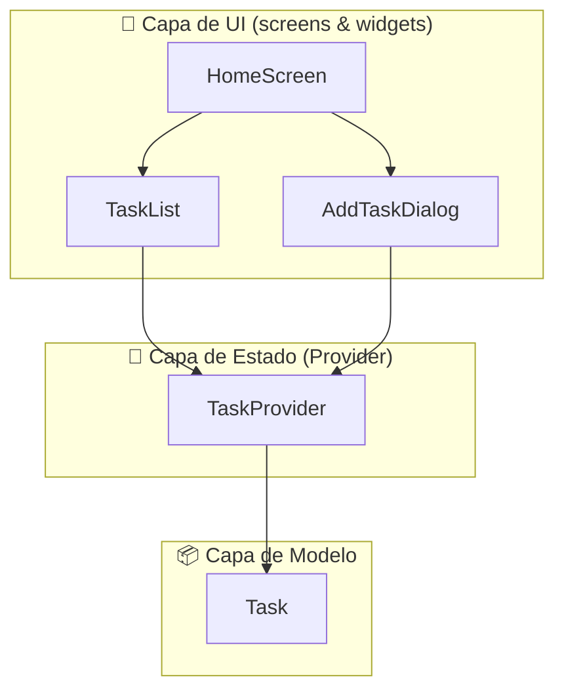
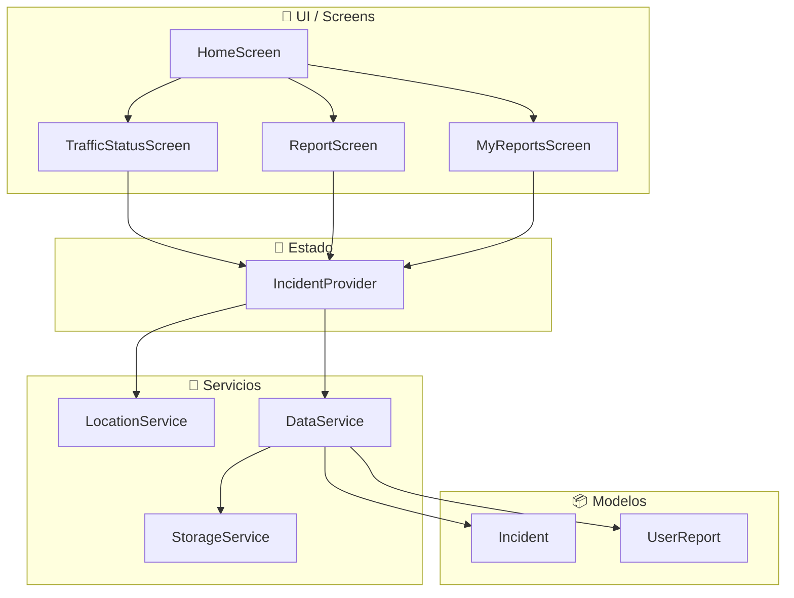
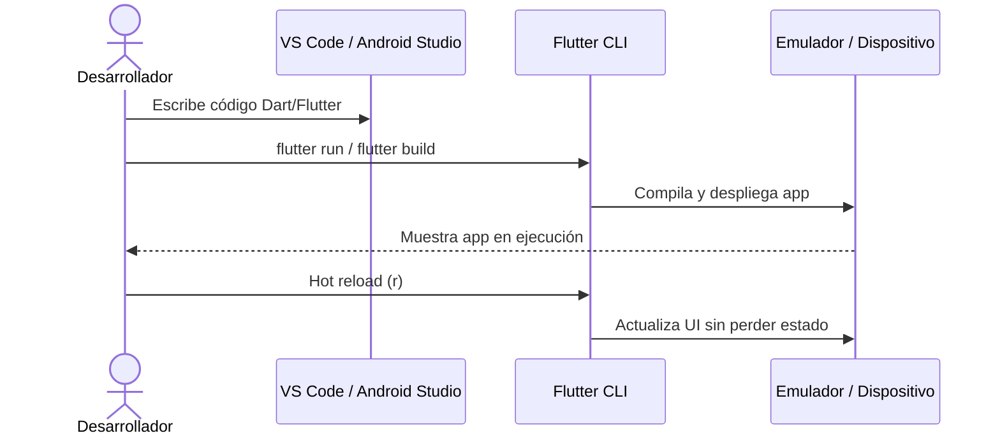

# 🌟 **Claud-IA — Guía Completa Flutter 2025**  
### 🚀 Instalación • SDKs • Configuración • Primer Proyecto • Arquitecturas • Ejemplos Reales

---

<p align="center">
  <!-- Reemplaza esta ruta por la de tu logo real en el repo -->
  
</p>

<p align="center">
  
  
  
  
</p>

---

# 📘 **Índice**
- [1. Introducción](#-introducción)
- [2. SDKs necesarios](#-sdks-necesarios)
- [3. Instalación y configuración](#-instalación-y-configuración)
- [4. Archivos .md del repositorio](#-archivos-md-del-repositorio)
- [5. Proyecto 1: Mi Primera App Flutter](#-proyecto-1-mi-primera-app-flutter)
- [6. Proyecto 2: App de Tránsito Flutter](#-proyecto-2-app-de-tránsito-flutter)
- [7. Diagramas, arquitectura y vistas](#-diagramas-arquitectura-y-vistas)
- [8. Recursos adicionales](#-recursos-adicionales)
- [9. Créditos](#-créditos)

---

# 📘 Introducción
Este repositorio reúne todo lo necesario para comenzar con Flutter desde cero:  
✔ Instalación completa  
✔ Configuración de SDKs  
✔ Creación del primer proyecto  
✔ Arquitecturas simples y profesionales  
✔ Ejemplos funcionales  
✔ Material listo para tu canal *Claud-IA* y para GitHub  

Ideal para estudiantes, desarrolladores principiantes y creadores de contenido educativo.

---

# 📦 SDKs necesarios
## 🧩 Flutter SDK  
🔗 https://docs.flutter.dev/get-started/install

Framework principal para crear apps móviles, web y desktop.

---
# macOS/Linux:
# Descarga Flutter SDK
git clone https://github.com/flutter/flutter.git -b stable
export PATH="$PATH:`pwd`/flutter/bin"


## 🤖 Android SDK (incluido con Android Studio)  
🔗 https://developer.android.com/studio  

Incluye:  
- Android SDK  
- Build-tools  
- Platform-tools  
- Emuladores Android  

Aceptar licencias:
```bash
flutter doctor --android-licenses
```

---

## 🍏 Xcode (solo macOS)  
🔗 https://apps.apple.com/app/xcode/id497799835  

Obligatorio para compilar y probar apps iOS.

---

## 🛠 Android Command Line Tools (opcional)  
🔗 https://developer.android.com/studio#command-tools  

Instalar por CLI:  
```bash
sdkmanager "platform-tools" "platforms;android-34" "build-tools;34.0.0"
```

---

# 🧭 Instalación y configuración
Guía completa y detallada:  
📄 **`guia_instalacion_flutter_detallada.md`**

Incluye:
- Instalación en Windows, macOS y Linux  
- Configuración del PATH  
- Android Studio + Xcode  
- Emuladores  
- Dispositivos físicos  
- Comandos esenciales  

---

# 📚 Archivos .md del repositorio

| Archivo | Descripción |
|--------|-------------|
| **creacion_applicaciones_mobiles.md** | Guía completa sobre tipos de apps móviles, arquitectura, monetización y tendencias. |
| **sdks_flutter_links.md** | Enlaces oficiales a todos los SDKs requeridos para Flutter. |
| **guia_instalacion_flutter_detallada.md** | Instalación y configuración completa del entorno Flutter. |
| **mi_primera_app_flutter.md** | Proyecto real de To-Do App con arquitectura profesional. |
| **proyecto_flutter_app_transito.md** | App de Tránsito con Providers, servicios y pantallas avanzadas. |

---

# 📝 Proyecto 1: Mi Primera App Flutter
📄 **`mi_primera_app_flutter.md`**

Incluye:
- Modelo (Task)  
- Provider (TaskProvider)  
- Pantalla principal  
- Widgets (TaskList y diálogo)  
- Arquitectura simple y escalable  

---

# 🚦 Proyecto 2: App de Tránsito Flutter
📄 **`proyecto_flutter_app_transito.md`**

Incluye:
- Uso de Providers  
- Servicios: ubicación, almacenamiento local, datos simulados  
- UI completa  
- Permisos Android/iOS  
- Roadmap profesional  

---

# 🧠 Diagramas, arquitectura y vistas

A continuación tienes **diagramas en Mermaid** que documentan la arquitectura de los proyectos y el ecosistema de desarrollo Flutter.  
Puedes verlos directamente en GitHub (ya soporta Mermaid) o en herramientas compatibles.

---

## 🌍 Diagrama 1 — Ecosistema Flutter + SDKs

```mermaid
flowchart LR
    A[💻 Desarrollador] --> B[🧩 Flutter SDK]
    B --> C[🤖 Android SDK<br/>+ Android Studio]
    B --> D[🍏 Xcode<br/>+ iOS SDK]
    B --> E[🌐 Web / Desktop (opcional)]

    C --> F[📱 App Android]
    D --> G[📱 App iOS]

    F --> H[Google Play Store]
    G --> I[Apple App Store]
```

---

## ✅ Diagrama 2 — Arquitectura de "Mi Primera App Flutter" (To-Do)



---

## 🚦 Diagrama 3 — Arquitectura de "App de Tránsito"



---

## 🔁 Diagrama 4 — Flujo básico de desarrollo Flutter



---

# 📌 Recursos adicionales

### 🐦 Flutter Docs  
https://docs.flutter.dev

### 🔵 Dart Docs  
https://dart.dev

### 🎨 Paquetes Flutter  
https://pub.dev

### ☁ Firebase (muy usado con Flutter)  
https://firebase.google.com

---

# 💙 Créditos
Proyecto organizado y documentado con:  
✨ *Claud-IA & ChatGPT — 2025*  

---

> Puedes adaptar rutas de imágenes, nombres de carpetas y ejemplos de diagramas según tu estructura real de proyecto. Este README está pensado como una base profesional, editable y lista para usar en GitHub.
